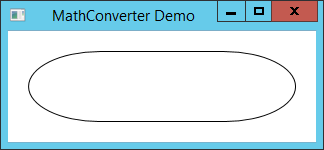
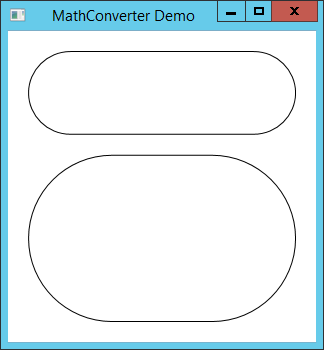
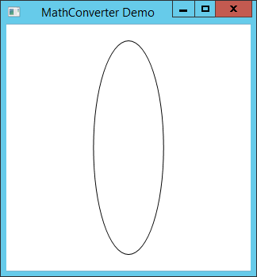
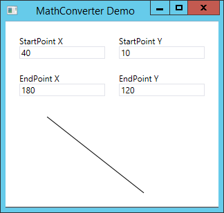
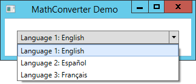
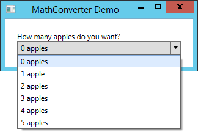

MathConverter
=============

A WPF Converter class that does it all


Installation:
-------------

`MathConverter` is available on [NuGet](https://www.nuget.org/packages/MathConverter/)

To install MathConverter, run the following command in the [Package Manager Console](https://docs.microsoft.com/en-us/nuget/tools/package-manager-console):

```
PM> Install-Package MathConverter
```


What is MathConverter?
----------------------

In WPF, bindings are absolutely incredible. They save a lot of time in GUI development. If you are unfamiliar with bindings, you can read Microsoft's documentation about them [here](http://msdn.microsoft.com/en-us/library/ms752347).

The main shortcoming with Bindings is that custom converters are needed so frequently.

`MathConverter` is the last converter you'll ever need. It can do anything you ask of it.


How does it work?
-----------------

Consider the problem of creating a rectangle with rounded corners.

-------------------

If you simply bind to the `ActualHeight`:

```xaml
<Border Margin="20" DataContext="{Binding RelativeSource={RelativeSource Self}}"
        BorderThickness="1" BorderBrush="Black" CornerRadius="{Binding ActualHeight}" />
```

You will get a flattened oval.



What you want to do is bind to *half* of the height. But that's not possible. This is why Microsoft included Converters for bindings. In this case, we have to create our own custom Converter.

```c#
class HalfValueRadiusConverter : IValueConverter
{
    public object Convert(object value, Type targetType, object parameter, CultureInfo culture)
    {
        return new CornerRadius((double)value / 2);
    }
    public object ConvertBack(object value, Type targetType, object parameter, CultureInfo culture)
    {
        throw new NotSupportedException();
    }
}
```

You have to add a `HalfValueRadiusConverter` to the control's resources:

```xaml
<Window.Resources>
    <local:HalfValueRadiusConverter x:Key="half" />
</Window.Resources>
```

and change the binding to this:

```xaml
CornerRadius="{Binding ActualHeight, Converter={StaticResource half}}"
```

But this converter can only be used to create `CornerRadius` objects. To generalize it, the body of the `Convert` method would have to be changed to:

```c#
switch (targetType.FullName)
{
    case "System.Double":
        return (double)value / 2;
    case "System.Windows.CornerRadius":
        return new CornerRadius((double)value / 2);
    default:
        throw new NotImplementedException();
}
```

Later, if you want to bind to two times a value, you have to add a new, similar class for `DoubleValueConverter` and add one to the resources before you can use it for a binding.

-------------

This is where `MathConverter` comes in handy. It is a single Converter class that does it all.

-------------


Getting Started
---------------

You can install [MathConverter from Nuget](https://www.nuget.org/packages/MathConverter/), or you can check out the [source from GitHub](https://github.com/timothylcooke/MathConverter)

Once you have MathConverter referenced, you need to add a `MathConverter` object to your resources.

```xaml
<Window.Resources>
    <math:MathConverter x:Key="math" />
</Window.Resources>
```

The `math` namespace is defined as follows:

```xaml
xmlns:math="http://hexinnovation.com/math"
```

Now when you use the converter, you specify a `ConverterParameter`.

```xaml
CornerRadius="{Binding ActualHeight, Converter={StaticResource math}, ConverterParameter=x/2}"
```

Our result:



You can see that it works well, no matter the height of the Border.

You can specify different radii by passing in multiple values for the parameter. Those values can be separated by either commas or semicolons. This was designed to mimmic the way `CornerRadius` objects can be created in XAML.

So the following converter parameters are equivalent:

```xaml
ConverterParameter=x/2
ConverterParameter=x/2;x/2;x/2;x/2
ConverterParameter='x/2,x/2,x/2,x/2'
```

But even this binding has a shortcoming. If the rectangle is taller than it is wide, the rounded rectangle becomes an oval.



We can easily fix it by making a `MultiBinding`.

```xaml
<Border.CornerRadius>
    <MultiBinding Converter="{StaticResource math}" ConverterParameter="min(x,y)/2">
        <Binding Path="ActualHeight" />
        <Binding Path="ActualWidth" />
    </MultiBinding>
</Border.CornerRadius>
```


The fact that we used x and y for variable names may seem to suggest that you can only bind to 3 or less values. `MathConverter` actually supports an unlimited number of variables. `x` is simply shorthand for `[0]`, `y` is shorthand for `[1]`, and `z` is shorthand for `[2]`. All other variables must be referenced by index.


Functions
---------

The `min` function is also interesting. It can take any number of arguments, except zero. It is an *N-value function*. There are two other N-value functions: `max` and `average` (which can also be written as `avg`). It should be noted that there are other N-value functions that we will come back to later.

There are also several *1-value* and *2-value functions* available. Those functions are: `cos`, `sin`, `tan`, `abs`, `acos`, `asin`, `atan`, `ceil`/`ceiling`, `floor`, `round`, `sqrt`, `deg`/`degrees`, `rad`/`radians`, `atan2`, and `log`. Again, there are more functions that we will come back to.

All functions are case-insensitive, so you can call them as you wish.

`deg` uses the function:
```c#
x => x / Math.PI * 180
```

and `rad` uses the function:
```c#
x => x / 180 * Math.PI
```

`round` accepts either one or two values. If the second value is ommitted, it defaults to zero. It works similarly to the [`System.Math.Round`](https://msdn.microsoft.com/en-us/library/system.math.round(v=vs.110).aspx) function. All other functions behave similarly to their corresponding functions in the [`System.Math`](https://msdn.microsoft.com/en-us/library/System.Math(v=vs.110).aspx) class.

`MathConverter` also replaces `e` and `pi` in Conversion strings with their corresponding numeric values, as defined in the [`System.Math`](https://msdn.microsoft.com/en-us/library/System.Math(v=vs.110).aspx) class.

`MathConverter` allows for inputs of several numeric types: `String`, `char`, `int`, `byte`, `sbyte`, `decimal`, `short`, `uint`, `long`, `ulong`, and `float`. The appropriate [`System.Convert.ToDouble`](https://msdn.microsoft.com/en-us/library/system.convert.todouble(v=vs.110).aspx) overload is used to convert these objects to doubles. `char` values are casted to ints before being converted.

`MathConverter` allows for conversions to the following types:

* `Double` (1 value must be specified).
* `Object` (1 value must be specified). This is the same as `double`, and `MathConverter` will in fact return a double.
* `CornerRadius` (1 value for the same radius for all four corners, or 4 values to specify the corners in the order of Top-Left, Top-Right, Bottom-Right, Bottom-Left).
* `GridLength` (1 value must be specified).
* `Thickness` (1 value for a uniform margin/padding, 2 for Left-Right and Top-Bottom margin/padding, and 4 for left, top, right, bottom)
* `Rect` (4 values specify the X, Y, Width, and Height)
* `Size` (2 values specify the Width and Height)
* `Point` (2 values specify the X- and Y- coordinates)

If you fail to specify a `ConverterParameter`, `MathConverter` will consider the type you are converting to, and the number of inputs. If they match up, it will use that.

So for the binding:

```xaml
<ColumnDefinition Width="{Binding Source={StaticResource Padding}, Converter={StaticResource math}}"/>
```

where `Padding` is defined in the resources as:
```xaml
<sys:Double x:Key="Padding">40</sys:Double>
```

`MathConverter` will see that you are attempting to convert a single value to a `GridLength`. Since `GridLength` requires one value, `MathConverter` will simply convert the value specified and return a `GridLength` with a value of 40. The net result is that the column will be 40 pixels wide. In this manner, `MathConverter` can be used to convert from any numeric type to any of its supported output types.

One interesting example of this is the following window:



The line is created as follows:

```xaml
<Path StrokeThickness="1" Stroke="Black" Grid.Row="4" Grid.ColumnSpan="3">
    <Path.Data>
        <PathGeometry>
            <PathFigure>
                <PathFigure.StartPoint>
                    <MultiBinding Converter="{StaticResource math}">
                        <Binding Path="Text" Mode="OneWay" ElementName="x1" />
                        <Binding Path="Text" Mode="OneWay" ElementName="y1" />
                    </MultiBinding>
                </PathFigure.StartPoint>
                <PathFigure.EndPoint>
                    <MultiBinding Converter="{StaticResource math}">
                        <Binding Path="Text" Mode="OneWay" ElementName="x2" />
                        <Binding Path="Text" Mode="OneWay" ElementName="y2" />
                    </MultiBinding>
                </PathFigure.EndPoint>
            </PathFigure>
        </PathGeometry>
    </Path.Data>
</Path>
```

Note that each `MultiBinding` could easily include `ConverterParameter="x,y"`, but because `Point` requires two values, and the `ConverterParameter` simply specifies to use the parameters in order, it's not necessary to include it.


Non-Numeric Types
-----------------

So far, we've only really talked about converting numeric types. `MathConverter` is also capable of conversions to several other types. Let's start by diving into an example. Suppose we want to create a `ComboBox` whose items are numbered.



For this example, we create an `IndexedCollection` class. If you want to see the full source for `IndexedCollection`, it is available [here](Demo/IndexedCollection.cs).
```c#
public class IndexedCollection<T> : ObservableCollection<IndexedElement<T>> { ... }
public class IndexedElement<T> : INotifyPropertyChanged
{
    public int Index { get; set; }
    public T Value { get; set; }
}
```

We create the following `Window`:
```xaml
<Window x:Class="MathConverterDemo.MainWindow"
        xmlns="http://schemas.microsoft.com/winfx/2006/xaml/presentation"
        xmlns:math="http://hexinnovation.com/math"
        xmlns:x="http://schemas.microsoft.com/winfx/2006/xaml"
        Title="MathConverter Demo" SizeToContent="Height" Width="324">
    <Window.Resources>
        <math:MathConverter x:Key="math"/>
    </Window.Resources>
    <ComboBox x:Name="cb" Margin="20">
        <ComboBox.ItemTemplate>
            <DataTemplate>
                <TextBlock>
                    <TextBlock.Text>
                        <MultiBinding ConverterParameter="format(&quot;Language {0}: {1}&quot;,x+1,y)" Converter="{StaticResource math}">
                            <Binding Path="Index" />
                            <Binding Path="Value" />
                        </MultiBinding>
                    </TextBlock.Text>
                </TextBlock>
            </DataTemplate>
        </ComboBox.ItemTemplate>
    </ComboBox>
</Window>
```

In the constructor of the `Window`, we add the following code:

```c#
public MainWindow()
{
    InitializeComponent();
    cb.ItemsSource = new IndexedCollection<string> { "English", "Español", "Français" };
    cb.SelectedIndex = 0;
}
```

The Converter `format("Language {0}: {1}",x+1,y)` will essentially `return string.Format("Language {0}: {1}", Index+1, Value);`

The real magic being done here is in the [`System.String.Format`](https://msdn.microsoft.com/en-us/library/b1csw23d(v=vs.110).aspx) method. If you unfamiliar with this method, you can see a lot of examples [here](http://msdn.microsoft.com/en-us/library/txafckwd).

`format` is another example of an N-value function. The only difference is that this particular function does not return a numeric value, but rather returns a string. Other non-numeric N-value functions are: `and`, `or`, `nor`. These functions take and return boolean values. The zero-value function function `now()` returns [`System.DateTime.Now`](https://msdn.microsoft.com/en-us/library/system.datetime.now(v=vs.110).aspx). There are also one-value functions useful for case-conversion: `tolower` / `lcase`, and `toupper` / `ucase`. When passed `null`, these functions will return `null`. When passed an object, they will call `ToString()` on the object and then convert to lower/upper case. There are a few two-value string-related functions: `contains`, `startswith`, and `endswith`. The first variable must be a string. The second variable must be either a string or a value whose `ToString()` returns a string with a non-zero length. If the first value is not a string, these methods will return `null`. If the second value is `null`, or if its `ToString()` method returns a `null` or empty string, the methods will also return `null`. Otherwise, the methods will return true if the string contains the second argument's `ToString()` value. Alternatively, the `contains` function can also be passed an `IEnumerable` of objects, and will return `true` if the `IEnumerable` contains the second argument, or `false` if it does not.

Let's look again at the `ConverterParameter` in the previous example: `ConverterParameter="format(&quot;Language {0}: {1}&quot;,x+1,y)"`. Because this is xaml, the `&quot;` characters are converted to `"` characters. Thus, at runtime, the `ConverterParameter` is `format("Language {0}: {1}",x+1,y)`. When `MathConverter` parses the `ConverterParameter`, it sees that "Language {0}: {1}" is a string. In order to include special characters in the string, you can simply backslash-escape them, just like you're used to. So `\r`, `\n`, `\"`, and `\t` (among others) are valid special characters that can be added to strings. At the moment, arbitrary unicode characters (such as `\u0000`) are not supported, but these can be added if there is sufficient demand.

You can also use the grave (`` ` ``) character to enclose strings, to avoid needing to add `&quot;` over and over again in a `ConverterParameter`. So we can actually use ``format(`Language {0}: {1}`,x+1,y)`` in the above example.

Next, we're going to take a look at an example of how to pluralize an object.

```xaml
<ComboBox x:Name="cb">
    <ComboBox.Items>
        <sys:Int32>0</sys:Int32>
        <sys:Int32>1</sys:Int32>
        <sys:Int32>2</sys:Int32>
        <sys:Int32>3</sys:Int32>
        <sys:Int32>4</sys:Int32>
        <sys:Int32>5</sys:Int32>
    </ComboBox.Items>
    <ComboBox.ItemTemplate>
        <DataTemplate>
            <TextBlock Text="{Binding ConverterParameter='format(&quot;{0} apple&quot; + (x == 1 ? &quot;&quot; : &quot;s&quot;), x)', Converter={StaticResource math}}" />
        </DataTemplate>
    </ComboBox.ItemTemplate>
</ComboBox>
```



Here, we can see that we change the format string based on whether or not the integer we are binding to is equal to 1. The format string is `"{0} apple" + (x == 1 ? "" : "s")`. We use the ternary conditional (`? =`) operator to change our format string from `{0} apple` to `{0} apples` depending on whether the value is plural or singular.


Interpolated Strings
--------------------
`MathConverter` supports interpolated strings, just like C#.

In the previous example, we used `ConverterParameter="format(&quot;Language {0}: {1}&quot;,x+1,y)"`. We established that this was equivalent to C#'s `string.Format("Language {0}: {1}", x+1, y)`.

In C#, you can simplify the call to string.Format by using an interpolated string. In this case, that would be `$"Language {x+1}: {y}"`. Similarly, in `MathConverter`, we can use ``ConverterParameter="$`Language {x+1}: {y}`"``. This will be converted by `MathConverter`'s compiler into a call to `string.Format("Language {0}: {1}", x+1, y)`.

Just like in C#, you can embed strings within in an interpolated string. So `MathConverter`'s interpolated strings can be just as complex as C#'s. For example, you can simplify the expression `ConverterParameter='format(&quot;{0} apple&quot; + (x == 1 ? &quot;&quot; : &quot;s&quot;), x)'` to simply be ```ConverterParameter='$`{x} apple{(x==1 ? `` : `s`)}`'```.


Visibility
----------
Often in WPF, it is important to convert to a `Visibility` option. It's often that a control should be hidden or collapsed based on a boolean binding. So you can use the functions `visibleorcollapsed` and `visibleorhidden` to convert a boolean value to a `Visibility` value. Both are one-value functions that will return `Visibility.Visible` if the value `true` is passed in as the parameter. If any other value (e.g. `false`, `null`, `"Hello World"`, or even the string `"true"`, etc.) is passed in, then either `Visibility.Collapsed` or `Visibility.Hidden` are returned, depending on which function was called.


Operators
---------

The ternary conditional operator is just one of several operators we can use. In general, the operators used in MathConverter will follow [the standard C# rules regarding operator ordering](https://docs.microsoft.com/en-us/dotnet/articles/csharp/language-reference/operators/), meaning you can usually expect it to behave just like C#. But there are a few notable exceptions:

* Since `MathConverter` is specifically designed to perform math calculations, the caret (`^`) operator does not perform the `XOR` operation. Rather, it is an exponent symbol. It uses [`System.Math.Pow`](https://msdn.microsoft.com/en-us/library/system.math.pow(v=vs.110).aspx) to evaluate expressions, and its precedence is just above multiplicative operations (`*`, `/`, and `%`).
* The multiplication operator can often be safely ommitted. A `ConverterParameter` value of `xyz` will evaluate to `x*y*z`. The parameter `x2y` will evaluate to `x^2*y` (or equivalently, `xxy` or `x*x*y`). Similarly, `2x3` is equivalent to `2*x^3` or `2*x*x*x`. Note that `x(2)` is equivalent to `x*(2)`, in the same way that `x(y+z)` is equivalent to `x*(y+z)`. Note that `1/xy` will evaluate to `1/x*y`, not to `1/(x*y)`, as you might expect.
* `MathConverter` doesn't support all of the operations that C# does. The following operators are not supported:
    * Assignment operators (`=`, `+=`, `&&=`, etc)
    * Logical operators (`|`, `&`, and `^` as `XOR`)
         - Note that `||` and `&&` are supported operators.
    * `is` and `as` (since Types are not supported)
    * Binary operations (`<<`, `>>`, `~`) are not supported.
    * The unary operators `++` and `--` are not supported, since they change the values of the inputs.
    * Primary operators (`x.y`, `f(x)`, `a[x]`, `new`, `typeof`, `checked`, `unchecked`) are not supported.


null
----

`MathConverter` fully supportes `null` values. You can include `null` in the `ConverterParameter`, and it will evaluate to `null`. Also, any bindings will still work if the binding returns `null`. In addition to supporting the `??` null-coalescing operator, it also includes the 2-value function `isnull`/`ifnull`. `MathConverter` evaluates the expression `x ?? y` in the same way that it would evaluate the expressions `isnull(x,y)` or `x == null ? y : x`.

`MathConverter` evaluates most of its values using the `dynamic` type. So `x+y` will yield `null` if `x = 3` and `y = null`. However, if `x = "Hello World"` and `y = null`, `x+y` will yield `"Hello World"`.


Parser:
-------

Each time a conversion must be made, `MathConverter` must parse and evaluate an expression. When it parses an expression, it reads through the string one character at a time, and returns a syntax tree. The parsing is done in the `Parser` class. The `Parser` returns an `AbstractSyntaxTree` for each comma-separated (or semicolon-separated) value. In an effort to improve efficiency, `MathConverter` uses a cache. It saves the syntax tree for each string it evaluates. As a result, it is discouraged to use the same `MathConverter` instance across your entire application. It is a better idea to use a different `MathConverter` object for each `UserControl`, `Page`, or `Window`. You can turn off caching on a per-instance basis:

```xaml
<math:MathConverter x:Key="nocache" UseCache="False" />
```


Thanks for reading!
-------------------

`MathConverter` is still a work in progress, and we're bound to add more features as we continue to use it.
